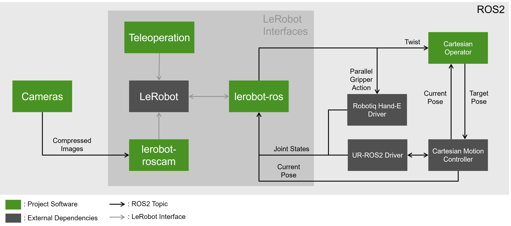

# ROS2SmolVLA Docker

This repository contains the Docker container definitions for running the [LeRobot](https://huggingface.co/lerobot)
Framework on the Universal Robotics family of collaborative robots.

The project is divided into three Docker containers:

1.  **ROS2 Driver:** Interfaces with the real robot
    (default [UR10e](https://www.universal-robots.com/de/produkte/ur10e/) +
    [Robotiq Hand-E](https://robotiq.com/products/adaptive-grippers#Hand-E)).
2.  **Simulation:** A simulation of the robotics lab environment based on Gazebo.
3.  **LeRobot Framework:** Contains the necessary interconnects to interface with ROS2.

## Prerequisites

1.  **GPU:** Inferencing and training a policy via LeRobot requires an NVIDIA GPU and a working driver
    installation.
2.  **OS:** This project has been tested on Ubuntu 24.04 with ROS2 Jazzy. Compatibility with other
    Versions/Distributions may vary. It is recommended to run a [realtime / low-latency](https://docs.universal-robots.com/Universal_Robots_ROS2_Documentation/doc/ur_client_library/doc/real_time.html) kernel.
3. **Docker:** Docker and NVIDIA's container toolkit have to be installed and configured.
4.  **Input:** A gamepad is highly recommended for 6DOF teleoperation.
5.  **Cameras:** You can use any camera, though additional configuration will be required. The LeRobot container is equipped to take ROS2 topics as input.
6.  **Network:** A 10GBit link is highly recommended for transmitting camera feeds via the network.
    Lower bandwidths may be possible but are untested.

### Dependency Summary:
- NVIDIA Drivers which support CUDA 12.6.3
- [NVIDIA Container Toolkit](https://docs.nvidia.com/datacenter/cloud-native/container-toolkit/latest/install-guide.html)
- XBOX One Gamepads need this driver: [xone](https://github.com/dlundqvist/xone)

Everything else should be handled by the docker containers.

## The Workflow

This section explains how to record datasets, run trained models, and how the components work together
to control the robot. More detailed explanations can be found in the respective GitHub repositories.

### Recording & Training

The data acquisition loop is as follows:

1.  Start the robot/simulation environment.
2.  Prepare the environment for the objective.
3.  Start the recording script with the desired arguments (e.g., number of episodes to be recorded).
4.  Record the episode.
    * If an error occurs, stop with the **"Arrow left"** key.
    * If the objective has been reached, stop the recording with **"Arrow right"**.
5.  Reset the environment. This can be done via teleoperation or moving the robots' arm directly with
    the teach pendant.
6.  Press **"Arrow right"** to start recording the next episode. Continue until the target number of
    episodes is reached.

The recording script will end after finishing the video transcode. To stop recording prematurely, press
the **"ESC"** key.


The usage of the LeRobot Framework is documented
[here](https://huggingface.co/docs/lerobot/getting_started_real_world_robot).

A sensible recording script invocation for recording 10 episodes of the same task might look like this:

```bash
lerobot-record \
  --robot.type=ur_10e_<sim|real|other> \
  --teleop.type=gamepad_6dof \
  --dataset.repo_id=<HF_USER>/<REPO_NAME> \
  --dataset.push_to_hub=True \
  --resume=true \
  --dataset.num_episodes=10 \
  --dataset.single_task='<YOUR_TASK_DESCRIPTION>' \
  --dataset.episode_time_s=60 \
  --play_sound=false
```

Collect at least 50 episodes for basic training, though more might be needed depending on the complexity
of the task.

After collecting the dataset, training can be started with:

```bash
lerobot-train \
  --policy.path=lerobot/smolvla_base \
  --dataset.repo_id=<HF_USER>/<REPO_NAME> \
  --output_dir=outputs/train/<TRAINING_NAME> \
  --job_name=<JOB_NAME> \
  --num_workers=8 \
  --save_checkpoint=true \
  --save_freq=2000 \
  --batch_size=64 \
  --steps=20000 \
  --policy.push_to_hub=false \
  --policy.use_amp=true \
  --policy.device=cuda \
  --wandb.enable=true \
  --policy.input_features='{"observation.images.camera1": {"shape": [3, 256, 256], "type": "VISUAL"}, "observation.images.camera2": {"shape": [3, 256, 256], "type": "VISUAL"}, "observation.images.camera3": {"shape": [3, 256, 256], "type": "VISUAL"}, "observation.state": {"shape": [7], "type": "STATE"}}' \
  --policy.output_features='{"action": {"shape": [7], "type": "ACTION"}}'
```

**Note:** The input and output features can be tweaked but must correspond to the input and output of
the configuration. Finetuning with a batch size of 64 and 20k steps takes ~8-10 hours on an NVIDIA A30.

Testing a trained model which has been uploaded to Hugging Face can be done with the following command:

```bash
lerobot-record \
  --robot.type=ur_10e_<sim|real|other> \
  --policy.path=<HF_USER>/<MODEL_NAME> \
  --dataset.repo_id=<HF_USER>/<EVAL_REPO_NAME> \
  --dataset.push_to_hub=False \
  --resume=false \
  --dataset.num_episodes=1 \
  --dataset.single_task='<YOUR_TASK_DESCRIPTION>' \
  --dataset.episode_time_s=120 \
  --play_sound=false
```

### LeRobot - Robot Interaction

The connection between ROS2 and LeRobot utilizes multiple components to enable seamless interaction.



To integrate a robot with LeRobot, a robot-specific class must be implemented. In this work, the LeRobot
framework is configured to send simple Cartesian velocity actions
($\delta x, \delta y, \delta z, \delta r, \delta p, \delta y$) on a ROS2 `TwistStamped` topic:
`/servo_node/delta_twist_commands`.

**Gripper Control:**
To operate the attached gripper, an action client is used. It sends an action goal each time the model's
gripper position output crosses the midpoint between the open and closed positions. This strategy avoids
sending gripper commands on every control cycle, which would otherwise slow down the system and operate
the gripper far too often to be healthy.

The interconnect between LeRobot and ROS2 uses a fork of the [lerobot-ros](https://github.com/ycheng517/lerobot-ros)
project, modified for this use case: [ros2smolvla_interface_lerobot](https://github.com/noah-boeckmann/lerobot-ros).

Available robot configurations: `ur_10e_real`, `ur_10e_sim`, and multiple more differing in the list of returned state observations.

**Control Loop:**
1.  **LeRobot Output:** Processed by a custom node (`robot_cartesian_operator` in both sim and real
    ROS packages).
2.  **Processing:** This node takes the `Twist` message and the robot's last known Cartesian position.
    It sends a target position, offset from the current position by the `Twist` input, to the
    `/cartesian_motion_controller/target_pose` topic.
3.  **Execution:** The
    [cartesian_motion_controller](https://github.com/fzi-forschungszentrum-informatik/cartesian_controllers)
    controls the robot's joints directly to reach the target frame. It also provides the current position
    of the robot.

This translation layer is necessary because the `cartesian_motion_controller` package does not offer
a direct Cartesian velocity interface. Consequently, the controllers provided by the default Universal
Robots ROS2 driver are not used. The controller's P-gains can be tweaked but should not be modified
after recording data.

### Camera Setup

The [ros2smolvla_interface_camera](https://github.com/una-auxme/ros2smolvla_interface_camera) package bridges ROS2 image topics
and the LeRobot framework. It accepts compressed images or raw image + depth data and exposes them as
a LeRobot camera. The current setup uses two Microsoft Azure Kinects and one generic 720p webcam, but
the package should work provided image topics are available.

In this project, an NVIDIA Jetson Orin AGX is used to ingest camera streams and publish them via ROS2
topics.

## Building the Containers

1.  **Configuration (.env):**
    To use Hugging Face (for datasets/models) and WandB (for training tracking), create a `.env` file
    next to `docker-compose.yaml` containing:
    ```bash
    HF_TOKEN=<YOUR_TOKEN_HERE>
    WANDB_API_KEY=<YOUR_TOKEN_HERE>
    ```

2.  **Build:**
    Run the following on a capable x86_64 computer:
    ```bash
    docker compose --profile sim --profile real build
    ```
    *Note: You can omit one of the profiles if you only need to build for simulation or real hardware.*

3.  **Run:**
    Start the containers using the desired profile either without or with GPU integration:
    ```bash
    docker compose --profile <sim|real> up
    ```
    ```bash
    docker compose -f docker-compose.yaml -f docker-compose.gpu.yaml --profile <sim|real> up
    ```
    **Important:** Running both the simulation container and the hardware driver container simultaneously
    is not supported.

## Using the Containers
Before starting the containers you have to enable the X capability:
```bash
xhost +local:docker
```

Once the containers are started, connect to them via:
```bash
docker compose exec <CONTAINER_NAME> bash
```
Inside the shell, you can start the respective applications:

### ur10e_real
Run the launch file to bring up the ROS2 driver for the UR10e:
```bash
ros2 launch ros2smolvla_ur10e_real ur.launch.py
```
**Network Config:** The robot must be connected and reachable on IP `192.168.56.102`. Your interface
is expected to be `192.168.56.101`.

**Controller Setup:** The container defaults to the `cartesian_motion_controller` and is configured to take commands via the `/cartesian_motion_controller/target_pose`
topic.

Run the following (in this or the LeRobot container) in case you want to activate/reactivate/stop certain controllers:

```bash
ros2 control set_controller_state <controller> inactive
ros2 control set_controller_state <controller> active
```

*Don't forget to run the `external_control` program on the robot pendant!*

### ur10e_sim
Run the simulation launch file:
```bash
ros2 launch ros2smolvla_ur10e_sim ur.launch.py
```
This brings up the simulation and camera topics. The correct controller starts automatically.

**Reset Cube:** Use `reset_cube x y z` (defined in `.bashrc`) to move the cube.

### ur10e_lerobot
This container includes the LeRobot framework. Two teleoperation aliases are provided for convenience
(gamepad required):

```bash
# For Real Robot
teleop_real="lerobot-teleoperate --robot.type=ur_10e_real --teleop.type=gamepad_6dof --display_data=false"
```
```bash
# For Simulation
teleop_sim="lerobot-teleoperate --robot.type=ur_10e_sim --teleop.type=gamepad_6dof --display_data=false"
```

**Reset Cube:** Use `reset_cube x y z` (defined in `.bashrc`) to move the cube.

Refer to the [LeRobot documentation](https://huggingface.co/docs/lerobot/getting_started_real_world_robot)
for usage details.

### Development
The easiest way to edit the code running in the containers is to clone the repos
in the respective ```./src/``` folder of this repo on the host machine. For this you can use [vcs-tool](https://github.com/dirk-thomas/vcstool)
to clone the ```.repos``` file:

```bash
vcs import ./src/<container> < smolvla_ur10e_<container>.repos
```

Then open the containers source path in your preferred editor and map the containers
source path to your development path by uncommenting the correct line in the [docker-compose.yaml](docker-compose.yaml).

Alternatively you can open VS Code inside of the running container by utilizing the
[Dev Container](https://marketplace.visualstudio.com/items?itemName=ms-vscode-remote.remote-containers)
extension.

## Used Resources
This project uses the following repositories and projects:
- [ros2smolvla_ur10e_real](https://github.com/una-auxme/ros2smolvla_ur10e_real) (ROS2 Package to interface with the
  real hardware)
- [ros2smolvla_ur10e_sim](https://github.com/una-auxme/ros2smolvla_ur10e_sim) (ROS2 Package to simulate the robot)
- [ros2smolvla_interface_lerobot](https://github.com/una-auxme/ros2smolvla_interface_lerobot) (Fork of an interface between ROS2 and
  LeRobot)
- [ros2smolvla_interface_camera](https://github.com/una-auxme/ros2smolvla_interface_camera) (Simple ROS2 image topic to LeRobot
  camera adapter)
- [cartesian_controllers](https://github.com/fzi-forschungszentrum-informatik/cartesian_controllers)
  (Used to control the requested cartesian position in joint-space)
- [robotiq_hande_driver](https://github.com/AGH-CEAI/robotiq_hande_driver) (Robotiq Hand-E Gripper driver)

## References
- [Cadene et al., "LeRobot: State-of-the-art Machine Learning for Real-World Robotics in Pytorch", GitHub, 2024](https://github.com/huggingface/lerobot)
- [Shukor et al., "SmolVLA: A Vision-Language-Action Model for Affordable and Efficient Robotics", arXiv:2506.01844, June 2025](https://arxiv.org/abs/2506.01844)
- [S. Macenski et al., "Robot Operating System 2: Design, architecture, and uses in the wild", Science Robotics vol. 7, May 2022.](https://www.science.org/doi/abs/10.1126/scirobotics.abm6074)
- [Scherzinger et al., "Forward Dynamics Compliance Control (FDCC): A new approach to cartesian compliance for robotic manipulators", IEEE/RSJ International Conference on Intelligent Robots and Systems (IROS), 2017](https://ieeexplore.ieee.org/document/8206325)
- [Universal_Robots_ROS2_Driver](https://github.com/UniversalRobots/Universal_Robots_ROS2_Driver)
- [Universal_Robots_ROS2_Description](https://github.com/UniversalRobots/Universal_Robots_ROS2_Description)
- [robotiq_hande-driver](https://github.com/AGH-CEAI/robotiq_hande_driver/)
- [robotiq_hande_description](https://github.com/AGH-CEAI/robotiq_hande_description)
- [lerobot-ros](https://github.com/ycheng517/lerobot-ros)